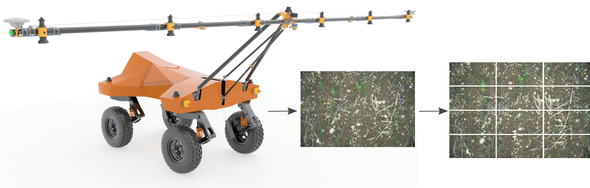

# smallSSD: The small robot company's semi-supervised detection dataset

`smallSSD` is an open source agricultural semi-supervised object detection dataset, containing **960** images labelled with wheat and weed bounding boxes and **100,032** unlabelled images.

All images were collected by the [Small Robot Company](https://www.smallrobotcompany.com/)'s Tom robot in 8 experimental fields with varying drill rates and fertilizer and herbicide application.



This repository returns a dataset, modelled off the [torchvision](https://pytorch.org/vision/stable/index.html) datasets:

```python
from torch.utils.data import DataLoader
from smallssd.data import LabelledData, UnlabelledData

labelled_loader = DataLoader(LabelledData())
```

This code expects the labelled data to be in the [`data`](data) folder.

More in-depth examples on how to get started with this data are available in the [benchmarks](benchmarks), where we train torchvision models against the data using both fully-supervised and pseudo labelling approaches.

### Installation

`smallSSD` can be installed with the following command:

```bash
pip install smallssd
```

### License
`smallSSD` has a [Creative Commons Attribution-NonCommercial 4.0 International](https://github.com/smallrobotcompany/smallssd/blob/main/LICENSE) license.
